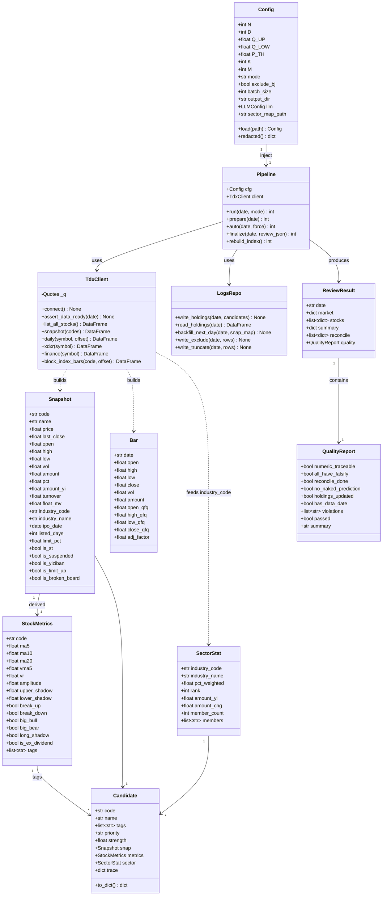
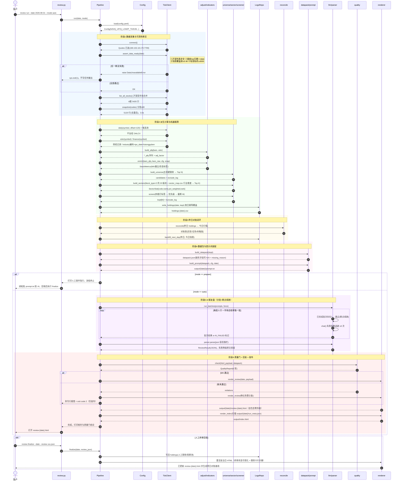
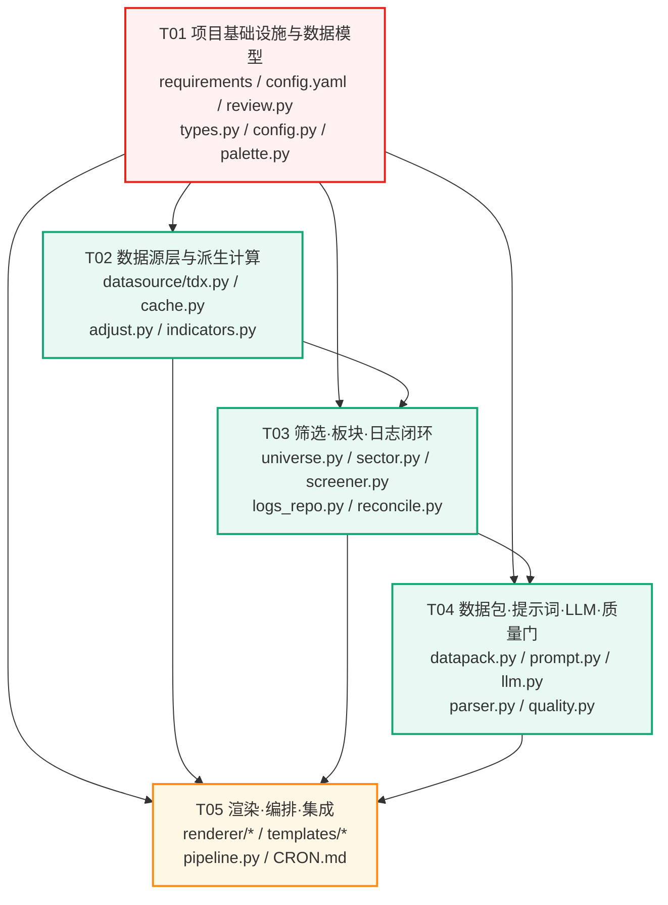

# A股每日自动复盘工具 · 系统设计

| 项目 | 内容 |
|---|---|
| Project Name | `a_share_daily_review` |
| Language | Python 3.13（venv：`/Users/yzreal/.workbuddy/binaries/python/envs/default/bin/python`）+ 原生 HTML/CSS/JS |
| 版本 | v0.1（P0 首版） |
| 上游文档 | `a-share-daily-review-prompt.md`（业务规则唯一真源）、`docs/PRD.md`（需求） |
| 文档作者 | 高见远（架构师） |
| 状态 | 已基于 mootdx 实测结果定稿 |

---

## 第零章：mootdx 数据能力实测结论

> **测试方法**：全部结论由 venv Python 跑临时脚本（`/tmp/t01~t25`）实测得出，**包含失败项如实记录**。测试日期 2026-08-31（交易日）。

### 0.1 结论总览

| # | 能力项 | 实测结果 | 是否可用 |
|---|---|---|---|
| 1 | 在线连通性 | `Quotes.factory(market='std')` 连通，服务器 `180.153.18.170:7709`，factory 0.4s | ✅ 可用 |
| 2 | 本地通达信 Reader | 本机**无**通达信安装（无 `vipdoc` / `T0002` / wine），`Reader.factory` 抛 `tdxdir 目录不存在` | ❌ 不可用 |
| 3 | 全市场列表 | 沪深双市场合并 51958 行 → A股 **5420 只**，5.3s | ✅ 可用（有坑，见 0.3） |
| 4 | 全市场行情快照 | `quotes()` 分批（≤80/批）5120 行，3.0s | ✅ 可用（有坑，见 0.3） |
| 5 | 日线历史 | `bars(frequency=9, offset=120)` 返回 120 根，0.0–0.2s | ✅ 可用 |
| 6 | 行业板块成分股 | `block_hy.dat` **size=0**（服务器不提供） | ❌ **拿不到** |
| 7 | 地域板块成分股 | `block_dy.dat` **size=0** | ❌ **拿不到** |
| 8 | 证监会行业板块 | `block_zjhhy.dat` **size=0** | ❌ **拿不到** |
| 9 | 概念/风格/指数板块 | `block_gn/fg/zs.dat` 可下载，但 `block_gn` 解析后板块名**大量乱码** | ⚠️ 部分损坏 |
| 10 | 板块指数（880xxx） | 652 个，名称干净（含 220 个行业指数），`index_bars` 可取 K 线 | ✅ 可用 |
| 11 | 个股→行业编码 | `finance().industry` 返回数字编码 | ✅ 可用（**名称映射缺失**） |
| 12 | 前/后复权（mootdx 原生） | `bars(adjust='qfq')` **崩溃**：`TypeError: NDFrame.fillna() got an unexpected keyword argument 'method'` | ❌ **已崩** |
| 13 | 除权除息识别 | `xdxr()` 可用，含 category=1 除权除息 + category=5 股本变化 | ✅ 可用 |
| 14 | 上市日期 | `finance().ipo_date`（如 `20010827`） | ✅ 可用（非推算） |
| 15 | 流通股本 | `finance().liutongguben` / `zongguben` | ✅ 可用 |
| 16 | 申万一/二级行业 | 全链路无任何接口提供 | ❌ 确认拿不到 |

### 0.2 数据源路线决策

**走在线模式**（`mootdx.Quotes.factory(market='std')`）。

理由：本机无通达信客户端、无本地数据目录、无 wine，本地 `Reader` 在实测中直接抛 `tdxdir 目录不存在`，本地路线物理上不成立。在线服务器实测连通且有真实当日行情（2026-08-31 涨停 87 家、炸板 38 家、成交额 Top1 中际旭创 189 亿）。

### 0.3 实测踩到的 5 个坑（架构必须规避）

| 坑 | 现象 | 架构规避方案 |
|---|---|---|
| **K1** | `stocks()` 默认 `market=MARKET_SH`，**只返回沪市**。深市标的（000651 格力、002594 比亚迪、300750 宁德）全部缺失 | `universe.py` 显式调用 `stocks(market=1) + stocks(market=0)` 合并 |
| **K2** | `quotes()` 对同一代码可能返回**重复行**（实测 600839 返回 3 次），且 5420 只中有 **210 只无返回** | 按 `code` 去重；缺失代码记为 `N/A` 并计入 `missing_log`；覆盖率 <90% 直接报错退出 |
| **K3** | `quotes()` 返回**脏零值**（600839 四川长虹全字段 0，`amount=5.88e-47`） | 统一走 `is_tradable()` 校验：`price>0 and amount>0 and vol>0`，否则判为停牌/无效并剔除 |
| **K4** | mootdx 原生复权 `adjust='qfq'/'hfq'` 在 **pandas 3.0.3 下崩溃**（`fillna(method=)` 已被移除） | **自实现前复权**（见 0.6），已实测验证通过。不降级 pandas，不依赖 mootdx 的 adjust |
| **K5** | `block()` 默认传不存在的文件名 `'block.dat'`，返回 386283 行**乱码**数据 | 不使用 `block()`；行业分组走 `finance().industry` 编码 |

### 0.4 全市场快照字段样例（实测）

`stocks()` 字段（仅 5 列，无行情）：

```
   code  volunit  decimal_point    name    pre_close
0  600519      100              2  贵州茅台  1297.4000
1  000001      100              2  平安银行    11.6500
```

`quotes()` 关键字段（46 列，节选核心 12 列）：

```
  market    code  price  last_close    open    high     low      vol        amount  servertime  bid1    ask1
0       1  600519 1299.52     1297.40 1297.99  1305.0  1286.0  23247.0  3.003034e+09  15:17:31  1299.52 1299.58
1       0  000001   11.72       11.65   11.64   11.77   11.62  908856   1.063281e+09  15:17:31    11.72   11.73
```

**派生字段**（架构内统一计算，均标注来源）：

- 涨跌幅 `pct = (price - last_close) / last_close × 100`（不复权口径，即真实涨跌幅）
- 成交额（亿元）`amount_yi = amount / 1e8`
- 换手率 `turnover = vol × 100 / liutongguben`（vol 单位=手，liutongguben 单位=股；茅台实测 23247×100/1250081562.5 = 0.186%，符合实际）
- 流通市值 `float_mv = price × liutongguben`（茅台实测 1.62 万亿，符合实际）

### 0.5 日线历史字段（实测）

```
                  open    close     high      low      vol        amount            datetime
2026-08-27 15:00  1304.00  1292.30  1305.00  1288.0  24767.0  3.203716e+09  2026-08-27 15:00
2026-08-28 15:00  1289.00  1297.40  1297.89  1288.0  16126.0  2.086008e+09  2026-08-28 15:00
2026-08-31 15:00  1297.99  1299.52  1305.00  1286.0  23247.0  3.003034e+09  2026-08-31 15:00
```

字段：`open/close/high/low/vol/amount/year/month/day/hour/minute/datetime/volume`。**OHLCV + 成交额齐全**，可支撑 MA5/10/20、5 日均量、量比、振幅、影线、突破判定。`offset=120` 实测 0.0–0.2s/只。

### 0.6 复权：自实现前复权（已验证）

**mootdx 原生复权不可用**（K4崩溃），改为自实现。算法：

```
对每笔除权除息记录（category=1），取 T 日前一交易日收盘价 P：
  每股派息 div  = fenhong / 10
  每股送转 sg   = songzhuangu / 10
  每股配股 pg   = peigu / 10，配股价 pgj = peigujia
  除权后理论价 theo = (P - div + pg × pgj) / (1 + sg + pg)
  复权因子 f = theo / P
  → T 日之前所有 bar 的 open/high/low/close 乘以 f
```

**实测验证（贵州茅台 2026-06-26 除权，每10股派 280.2423 元）**：

| 日期 | 不复权收盘 | 复权因子 | 前复权收盘 |
|---|---|---|---|
| 2026-06-24 | 1207.68 | 0.976880 | 1179.76 |
| 2026-06-25 | 1212.10 | 0.976880 | **1184.08**（= 1212.10 − 28.02 ✓） |
| 2026-06-26 | 1168.63 | 1.000000 | 1168.63 |

连续性检查：前复权后 6/25 收 1184.08 → 6/26 开 1199.00（+1.26% 正常波动）；不复权口径下该处是 −1.08% 的**除权假异动**，已消除。✅ 算法正确。

**口径分工**：
- **涨跌幅**：用**不复权**价（`price` vs `last_close`）—— 真实涨跌幅，用于价格异动标签
- **均线/形态/关键价位**：用**前复权**序列 —— 避免除权造成的均线断裂与假突破

### 0.7 板块分类：实测结论（Q1 依据）

- 行业/地域/证监会行业**成分股文件在服务器上 size=0**，物理上拿不到
- `block_gn.dat`（概念）可下载（757083 字节），但解析后 107 个板块名**大量乱码**（如 `'\x00300942\x003'`、`'03\x00600805'`），不可信
- **可用且关键**：`block()`（默认 `block.dat`）返回 386283 行，其中 **`block_type==2` 子集共 20 个板块名称干净、成分股完整可用**，已复验（2026-08-31 实测）：
  - 含 **ST板块**（203 只）、沪深300（300）、创业板指（100）、科创50（50）、中证A50（50）、深证成指（39）、上证50（50）
  - 概念类：一带一路（400）、专精特新（400）、融资融券（386）、粤港澳（369）、雄安新区（231）、海峡西岸（165）、海南自贸（47）、上海自贸（84）、通达信88（88）、精选指数（7）
- **行业维度**：`finance().industry` → 个股→行业**数字编码**（实测：银行=1、汽车=7、食品=14、家电=23、软件=24、电气设备=29、医药=34、半导体=35、有色=36、酿酒=37、电池=43、电子=51），同编码分组自洽；编码→行业名称 mootdx **不提供**，需外部映射
- **缺失**：`industry` 编码 → 行业名称的**映射表 mootdx 不提供**（grep 全包无 `industry`/`hangye` 映射文件）；板块指数 ↔ industry 编码对应关系**无法实测确认**

**已锁定决策（Q1，双轨可插拔）**：
- **P0 板块维度**：使用 `block_type==2` 的 20 个板块（含 ST板块）作为板块分组与「板块强势 Top K」依据，名称直接取自该板块（干净可用）
- **P0 行业维度（可插拔增强）**：走本地映射表 `data/sector_map.csv`（industry 编码 → 行业名 + 行业分类），文件缺失或某编码未命中时该字段**输出 N/A**，绝不编造
- HTML 全局显式标注「板块=通达信 block_type=2 板块（含 ST板块）；行业=本地映射表，缺失 N/A；非申万口径」

### 0.8 次新 / ST / 停牌 / 一字板：实测判定

| 项 | 判定方式 | 实测结果（2026-08-31 全市场 5420 只） |
|---|---|---|
| 次新 | `finance().ipo_date`（**接口字段，非首根K线推算**）→ 上市交易日数 < D 剔除 | 接口可用，茅台 `20010827` |
| ST/退市 | 名称匹配 `ST|退` | 命中 200 只 |
| 停牌/无成交 | `price==0 or amount==0 or vol==0` | 命中 7 只 |
| 一字板 | `open==high==low==price` 且 `price>0` | 命中 11 只 |
| 涨停 | 按代码前缀限幅：`30/68`→20%，`60/00`→10%；`price >= last_close×(1+lim/100)×0.9995` | 命中 **87 家** |
| 炸板 | 同上限幅；`high >= 涨停价×0.9995` 且 `price < 涨停价×0.9995` | 命中 **38 家** |
| 北交所 | A股正则 `^(60|68|00|30)\d{4}$` 天然排除 8/4 开头 | 已排除 |

### 0.9 性能实测基线

| 步骤 | 实测耗时 |
|---|---|
| 沪深列表合并（51958 行） | 5.3s |
| 全市场行情快照（5120 只，68 批） | 3.0s |
| `finance()` 单只 | ~0.05s → **候选池 500 只约 25s** |
| `bars()` 单只 120 根 | 0.0–0.2s → **候选池 500 只约 50s** |
| `index_bars()` 板块指数 | <0.1s |

→ 端到端 P0 目标（G1 ≤10 分钟）在数据层约 **1.5 分钟**，余量充足。

---

## 第一章：Q1–Q9 决策表

| # | 问题 | 决策 | 依据（实测） |
|---|---|---|---|
| **Q1** | 板块分类口径 | **双轨可插拔**：① P0 板块维度用 `block_type==2` 的 20 个板块（含 ST板块，成分股实测干净可用）做分组与「板块强势 Top K」；② 行业维度走本地可插拔映射表 `data/sector_map.csv`（industry 编码→行业名+分类），文件缺失或某编码未命中则**该字段输出 N/A**。**申万一/二级降级为 P1** | 行业/地域成分股文件 `block_hy/dy/zjhhy.dat` 均 size=0、`block_gn` 解析乱码；但 `block()` 的 `block_type==2` 子集 20 板块（含 ST板块 203 只）实测名称干净、成分股完整；`finance().industry` 编码可用但名称映射 mootdx 不提供 → 改用本地 `sector_map.csv` 可插拔，缺失即 N/A，避免硬编编造 |
| **Q2** | 量比口径 | **接受「当日量 ÷ 近 5 日均量」近似**，每处显示标注 `[口径:日线近似]`；分钟级精确口径留 P1-2 | mootdx 无分钟级全市场均量数据的低成本批量路径；提示词第二十三条已预置该兜底条款；`bars()` 日线实测可支撑 |
| **Q3** | 复权口径 | **涨跌幅用不复权（真实涨幅）；均线/形态/关键价位用自实现前复权**；除权日从 `xdxr()` 精确识别并打【除权】标签、从价格异动维度剔除 | 实测 `bars(adjust='qfq')` 在 pandas 3.0.3 下崩溃（K4）；自实现前复权已在茅台 2026-06-26 除权日验证正确 |
| **Q4** | 涨跌幅限制识别 | **按代码前缀自动识别**：`30/68`→20%，`60/00`→10%（ST 5% 已在排除清单剔除，不参与）；北交所以 `^(60|68|00|30)\d{4}$` 正则天然排除，`exclude_bj=true` 保留为显式开关 | 实测涨停 87 家 / 炸板 38 家，判定结果与当日行情自洽（涨停样例涨幅均在 9.96%–10.09%） |
| **Q5** | M 默认值 | **M=60** | 实测候选池 5420 只、四维筛选后留存充足；60 只 ÷ 5 只/批 = 12 批 AI 请求，成本与人工终审时长（G1 ≤20min）平衡 |
| **Q6** | auto 供应商 | **DeepSeek（OpenAI 兼容 SDK，`openai` 包）**，支持**断点续跑**（已完成批次落盘后跳过，`--force` 强制重跑）；**API key 走环境变量**（如 `DEEPSEEK_API_KEY`，`config.yaml` 仅存 provider/model，绝不落盘明文 key）；`auto` 模式代码就绪，待填 key 后联调 | OpenAI 兼容协议可低成本切换通义/智谱；分批 + 落盘是断点续跑充分条件；key 走环境变量避免明文入库 |
| **Q7** | 定时调度 | **P1**；P0 只交付 `docs/CRON.md` 模板（cron + launchd）+ 交易日判断伪代码 | 调度非复盘价值闭环的必要条件；P0 手动执行即可验证 G1/G2/G3 |
| **Q8** | 质量门不通过 | **标红发布，不阻断**：命令行报错 + exit code 2 + HTML 顶部红色警示条 + 页脚质量门明细 | 复盘的价值依赖人工终审（US-3），阻断会丢失已生成内容；标红已满足"不静默通过" |
| **Q9** | 数据安全边界 | **全程不含持仓/成本/账户信息**；数据流严格限定在行情+板块+日志；纯本地文件，不做鉴权 | 数据源本身不提供账户类字段，架构上也不引入任何持仓输入口 |

---

## 第二章：实现方案与框架选型

### 2.1 核心判断

这是一个**单机批处理的 CLI 管道工具**，不是 Web 服务、不是长期运行进程、不需要并发与状态管理。因此：

> **不上任何重框架**（不引入 FastAPI/Django/Celery/Scrapy/PyQt）。

技术难点不在框架，而在三处：
1. **数据可信性** —— 实测暴露了 5 个坑（K1–K5），脏数据极易静默流入 HTML
2. **零幻觉** —— 每个展示值必须可溯源到原始字段或显式计算式，缺失必须显式 `N/A`
3. **幂等可重跑** —— 同一交易日重复执行不得产生重复日志/重复索引卡片

### 2.2 选型与理由

| 层 | 选型 | 理由 |
|---|---|---|
| CLI | **stdlib `argparse`** | 仅 3 条子命令（`run` / `finalize` / `index`），argparse 足够，不引入 Click/Typer |
| 数据模型 | **stdlib `dataclasses`** | 纯数据容器，无需 pydantic 的运行时校验（校验逻辑由质量门统一承担） |
| 行情接入 | **mootdx 0.11.7（在线 `Quotes.factory(market='std')`）** | 已锁定数据源；实测连通可用；本地 Reader 实测不可用 |
| 数值计算 | **pandas 3.0.3 + numpy 2.4.6** | 已装；K 线滚动窗口/分组聚合天然契合 |
| 复权 | **自实现**（`src/adr/adjust.py`） | mootdx 原生 `adjust` 在 pandas 3.0 崩溃（K4），已实测自实现算法正确 |
| 配置 | **PyYAML**（`config.yaml`） | PRD P0-19 明确要求 YAML；纯 Python 包，无编译依赖 |
| 模板渲染 | **Jinja2** | HTML 需条件/循环/过滤器（涨跌取色、N/A 渲染）；纯 Python 包。**不引入构建工具，输出即静态 HTML** |
| LLM 调用 | **openai SDK（DeepSeek 兼容）** | 统一多供应商兼容协议；**降级方案**：若安装失败，`llm.py` 保持同样函数签名改用 `requests`（已装 2.34.2）直连 `/chat/completions` |
| 日志 | **stdlib `logging`** | 无需 loguru 的花哨特性 |
| 前端 | **原生 HTML/CSS/JS，零构建、零外链** | 硬约束：单文件自包含、可离线双击打开。CSS/JS 全部内联进 `<style>`/`<script>` |
| 持久化 | **CSV（留存日志）+ JSON（AI 结果/终审）+ 本地文件** | 单机本地，无需数据库 |

### 2.3 架构模式

**管道-过滤器（Pipe-Filter）+ 分层**：

```
数据层 TdxClient → 派生层（复权/指标）→ 筛选层（排除/四维/排序/截断）→ 板块层
    → 装配层（数据包/提示词）→ AI层（LLM/解析）→ 质量门 → 渲染层 → 输出
```

每层之间以 **dataclass / JSON-serializable dict** 传递，层间无反向依赖。`pipeline.py` 是唯一编排者。

### 2.4 防脏数据设计（硬约束落地）

`TdxClient` 启动时执行 **4 道数据可用性断言**，任一失败立即 `sys.exit(1)`，**不写入任何输出文件、不静默顶替**：

```python
def assert_data_ready(date: str) -> None:
    1. stocks(market=1) 与 stocks(market=0) 均返回非空      # 防 K1
    2. bars(基准指数).最后一根.datetime.date() == date       # 防旧数据顶替
    3. 全市场快照覆盖率 = 有效行数 / A股总数 ≥ 0.90          # 防 K2
    4. amount_yi > 0 的有效标的数 ≥ 3000                    # 防 K3 脏零值
```

同时全局约定：**任何字段取不到，一律写 `N/A` 并附 `missing_reason`，禁止推算、禁止静默顶替**。

---

## 第三章：文件列表

```
a_share_daily_review/
├── review.py                          # CLI 入口：run / finalize / index 三条子命令
├── config.yaml                        # 全部可调参数（N/D/Q_UP/Q_LOW/P_TH/K/M、路径、mode、LLM）
├── requirements.txt                   # 依赖声明（含已装标注）
├── README.md                          # 安装、首次运行、双模式使用说明
│
├── src/adr/
│   ├── __init__.py                    # 包初始化与版本号
│   ├── config.py                      # 加载/校验 config.yaml，冻结为 Config dataclass，api_key 脱敏
│   ├── logging_setup.py               # 统一日志格式与 logs/run-{date}.log 落地
│   ├── types.py                       # 全部核心 dataclass（Bar/Snapshot/StockMetrics/SectorStat/Candidate/…）
│   │
│   ├── datasource/
│   │   ├── __init__.py
│   │   ├── tdx.py                     # mootdx 封装：双市场列表合并、分批快照、日线、xdxr、finance、板块指数；含 4 道可用性断言
│   │   └── cache.py                   # 原始行情本地缓存（data/cache/{date}/），保证幂等重跑不重复打网
│   │
│   ├── adjust.py                      # 自实现前复权（基于 xdxr），产出 *_qfq 序列
│   ├── indicators.py                  # MA5/10/20、5日均量、量比、振幅、影线、突破/跌破、大阳大阴
│   ├── universe.py                    # 全市场快照构建 + 候选池 Top N + 排除清单五项硬剔除 + exclude_log
│   ├── sector.py                      # 双轨板块：① 用 block_type==2 的 20 板块做分组/Top K ② 行业维度从 data/sector_map.csv 可插拔映射，缺失 N/A
│   ├── screener.py                    # 四维异动打标签 + 炸板标记 + 优先级排序 + M 截断 + truncate_log
│   ├── logs_repo.py                   # holdings-{date}.csv 读写、次日回填、按日幂等覆盖
│   ├── reconcile.py                   # 昨日对账：三态判定（兑现/证伪/未触发）+ 对账表
│   │
│   ├── datapack.py                    # 候选数据包装配：每只留存标的的全部原始字段，缺失显式 N/A + missing_reason
│   ├── prompt.py                      # 提示词装配：注入参数与日期，拼装 prompt.txt
│   ├── llm.py                         # DeepSeek(OpenAI兼容) 分批调用、指数退避重试≤3、断点续跑、token 统计
│   ├── parser.py                      # AI 输出 JSON 解析（容忍 ```json 围栏），失败降级为原文保留
│   ├── quality.py                     # 质量门 6 项校验，产出 QualityReport（不通过=标红不阻断）
│   │
│   ├── renderer/
│   │   ├── __init__.py
│   │   ├── review_page.py             # 渲染每日单页 review-{date}.html
│   │   └── index_page.py              # 渲染历史归档 index.html（年月分组 + 前端检索）
│   │
│   └── pipeline.py                    # 唯一编排者：prepare / auto / finalize 三条流程
│
├── templates/
│   ├── review.html.j2                 # 每日单页模板（CSS/JS 内联，A股配色变量）
│   └── index.html.j2                  # 归档索引模板
│
├── assets/
│   └── palette.py                     # A股配色常量（涨红 #E1251B / 跌绿 #17A673 等），单一真源
│
├── prompt_src/
│   └── a-share-daily-review-prompt.md # 上游提示词模板（软链或副本，参数注入源）
│
├── data/
│   ├── sector_map.csv                 # 可插拔行业映射表：industry编码,行业名,行业分类（文件缺失/编码未命中→N/A）
│   ├── logs/holdings-{date}.csv       # 留存日志（按日幂等）
│   ├── reviews/{date}.json            # AI 结构化复盘结果
│   ├── snapshots/{date}.json          # 当日全市场快照留痕（供对账与复算）
│   └── cache/{date}/                  # 原始行情缓存
│
├── output/
│   ├── index.html                     # 历史归档索引
│   └── {date}/
│       ├── review-{date}.html         # 每日单页（自包含）
│       ├── prompt.txt                 # prepare 模式产物
│       ├── datapack.json              # 候选数据包
│       ├── quality.json               # 质量门报告
│       └── run_meta.json              # 运行配置与耗时（供索引页读取）
│
├── logs/run-{date}.log                # 运行日志
└── docs/
    ├── PRD.md
    ├── DESIGN.md                      # 本文档
    └── CRON.md                        # 调度模板（cron/launchd）+ 交易日判断伪代码（P1 前哨）
```

---

## 第四章：数据结构与接口定义

### 4.1 类图



### 4.2 关键函数签名

```python
# src/adr/datasource/tdx.py
class TdxClient:
    def connect(self) -> None: ...
    def assert_data_ready(self, date: str) -> None:
        """4 道断言：双市场列表非空 / 最新交易日匹配 / 快照覆盖率≥0.90 / 有效标的≥3000。
        任一失败 → raise DataUnavailableError → 上层 sys.exit(1)，不写任何输出。"""

    def list_all_stocks(self) -> pd.DataFrame:
        """沪深双市场合并，过滤 A 股正则 ^(60|68|00|30)\d{4}$，返回 code/name。"""

    def snapshot(self, codes: list[str]) -> pd.DataFrame:
        """分批 ≤80 调 quotes()，按 code 去重，缺失代码不补行（由上层标 N/A）。"""

    def daily(self, symbol: str, offset: int = 120) -> pd.DataFrame: ...
    def xdxr(self, symbol: str) -> pd.DataFrame: ...
    def finance(self, symbol: str) -> pd.DataFrame: ...
    def block_index_bars(self, code: str, offset: int = 30) -> pd.DataFrame: ...


# src/adr/adjust.py
def build_qfq(bars: pd.DataFrame, xdxr: pd.DataFrame) -> pd.DataFrame:
    """自实现前复权。
    对 category==1 的每笔除权：theo=(P-div+pg*pgj)/(1+sg+pg)；f=theo/P；
    T 日之前所有 bar 的 OHLC 乘 f，产出 open_qfq/high_qfq/low_qfq/close_qfq/adj_factor。
    返回新 DataFrame，不修改入参。"""


# src/adr/indicators.py
def enrich(bars_qfq: pd.DataFrame, bars_raw: pd.DataFrame,
           cfg: Config, snap: Snapshot) -> StockMetrics:
    """算 MA5/10/20（前复权）、5日均量、量比 vr=vol/vma5、振幅、上下影线、
    突破跌破（收盘确认为准）、大阳大阴（按 limit_pct 分板）、长影线；
    合并 xdxr 除权日 → is_ex_dividend。缺失一律 None（渲染为 N/A）。"""


# src/adr/universe.py
def build_universe(client: TdxClient, cfg: Config, date: str) -> tuple[pd.DataFrame, pd.DataFrame]:
    """返回 (candidates_df, exclude_log_df)。
    流程：全市场快照 → exclude_bj/正则过滤 → 五项硬剔除（ST、次新<D、一字板、
    停牌、成交额<1亿且流通市值<50亿）→ 按成交额降序取 Top N。
    每条剔除记录 reason 到 exclude_log。"""


# src/adr/sector.py
def build_sectors(candidates: pd.DataFrame, cfg: Config, blocks: pd.DataFrame,
                  sector_map: dict | None = None) -> dict[str, SectorStat]:
    """双轨板块：① 用 block_type==2 的 20 个板块（含 ST板块）分组，算成分股流通市值加权涨幅
    pct_weighted、成交额及环比、排名，输出 Top K；② 行业维度经 data/sector_map.csv 可插拔映射
    （industry编码→行业名+分类），sector_map 为 None 或编码未命中时该字段置 N/A。"""

def load_sector_map(path: str) -> dict | None:
    """读取 data/sector_map.csv → {industry_code: {name, category}}；文件缺失返回 None。"""


# src/adr/screener.py
def screen(candidates: pd.DataFrame, metrics: dict, sectors: dict, cfg: Config)
        -> tuple[list[Candidate], list[dict]]:
    """四维打标签（量能/价格/形态/板块）+ 炸板标记 → 优先级(触发维度数) →
    同优先级按 |pct|×vr 降序 → 截断至 M → 返回 (kept, truncate_log)。
    每只 Candidate.trace 记录每个标签触发时的原始数值，供溯源。"""


# src/adr/reconcile.py
def reconcile(client: TdxClient, date: str, cfg: Config) -> list[dict]:
    """读上一交易日 holdings csv → 按代码匹配今日行情 → 三态判定
    （兑现/证伪/未触发）→ 返回 代码|昨日预案|今日兑现/证伪|修正结论。
    首日（无昨日志）返回空并在 HTML 标注「首日运行，无对账数据」。"""


# src/adr/datapack.py
def build_datapack(kept: list[Candidate], client: TdxClient, cfg: Config) -> dict:
    """为每只标的导出全部原始字段：20 日 OHLCV、量比、5/10/20 日均量、涨跌幅、
    换手率、流通市值、行业编码及板块涨幅排名、涨停/跌停价、是否炸板、
    昨日留存历史判断。缺失字段写 'N/A' 并附 missing_reason。"""


# src/adr/prompt.py
def build_prompt(datapack: dict, cfg: Config, date: str) -> str:
    """以 prompt_src/a-share-daily-review-prompt.md 为模板，注入
    N/D/Q_UP/Q_LOW/P_TH/K/M 与 date，拼接数据包 → output/{date}/prompt.txt。"""


# src/adr/llm.py
class LLMClient:
    def __init__(self, cfg: Config):
        """从环境变量读取 API key（如 DEEPSEEK_API_KEY），config.yaml 仅提供 provider/model；
        未配置 key 时初始化即抛 ConfigError，auto 流程降级为提示用户填 key。"""

    def chat(self, prompt: str, batch_id: str) -> tuple[str, dict]:
        """调用 DeepSeek(OpenAI兼容)。失败指数退避重试 ≤3 次。
        返回 (content, meta{total_tokens, elapsed})。批次已存在结果则跳过（断点续跑）。"""

    def run_batches(self, prompts: list[tuple[str, str]], force: bool) -> list[dict]:
        """每批 5 只 + 市场总结单独一批。单批失败 → 标记 AI_FAILED 待人工补充，
        不中断整轮。"""


# src/adr/quality.py
def check(html_payload: dict, datapack: dict, quality_cfg) -> QualityReport:
    """6 项：① 数值溯源（HTML 中每个价位/涨幅/量比能在 datapack 匹配到或为合法 N/A）
    ② 每只有非空证伪条件 ③ 非首日对账已执行 ④ 无裸预测词（有望/应该会/谨慎乐观/我觉得）
    ⑤ 留存日志已更新 ⑥ 输出含数据截止日期。返回 QualityReport；不通过不阻断。"""


# src/adr/renderer/review_page.py
def render_review(date: str, payload: dict, out_path: str) -> None:
    """渲染单页 HTML：CSS/JS 全内联，零外链，双击即开。
    取色一律来自 assets/palette.py（涨红 #E1251B / 跌绿 #17A673）。"""
```

### 4.3 A股配色（单一真源 `assets/palette.py`）

```python
UP        = "#E1251B"   # 涨 / 放量 / 兑现 / 主线
UP_BG     = "#FFF1F0"
DOWN      = "#17A673"   # 跌 / 缩量 / 证伪 / 弱势
DOWN_BG   = "#E8F8F2"
FLAT      = "#8C8C8C"   # 平盘 / 未触发 / N/A
WARN      = "#FA8C16"   # 证伪条件 / 赔率不足 / 质量门告警
TEXT      = "#1F2329"
TEXT_SUB  = "#646A73"
BG        = "#FFFFFF"
CARD      = "#FAFAFA"
BORDER    = "#E5E6EB"
```

---

## 第五章：程序调用流程

### 5.1 时序图（prepare 与 auto 双路径）



### 5.2 幂等设计要点（时序图中的关键约束）

| 环节 | 幂等手段 |
|---|---|
| `write_holdings` | **按日覆盖**（`holdings-{date}.csv` 整体重写），不追加 → 重跑不产生重复条目 |
| 原始行情 | 首次拉取写 `data/cache/{date}/`，重跑直接读缓存 → 不重复打网、结果一致 |
| AI 批次 | 结果按 `batch_id` 落盘 `data/reviews/{date}.json`；已存在则跳过，`--force` 才重跑 |
| 索引页 | `run_meta.json` 以日期为主键去重 → 重跑不产生重复卡片 |
| `finalize` | 终审状态写回同一行，不新增行 |

---

## 第六章：任务分解

> 颗粒度到"一组函数/一个文件"，按依赖顺序排列。**T02–T04 仅需依赖 T01**，可最大程度并行。

| 任务 | 名称 | 源文件 | 依赖 | 优先级 | 输入 → 输出 |
|---|---|---|---|---|---|
| **T01** | 项目基础设施与数据模型 | `requirements.txt`、`config.yaml`、`review.py`、`src/adr/__init__.py`、`src/adr/config.py`、`src/adr/types.py`、`src/adr/logging_setup.py`、`assets/palette.py`、`data/sector_map.csv`（可插拔，可空）、`README.md` | — | P0 | 空 → 可运行的 CLI 骨架、`Config`/`Snapshot`/`Bar` 等 dataclass、配色常量、配置示例 |
| **T02** | 数据源层与派生计算 | `src/adr/datasource/__init__.py`、`src/adr/datasource/tdx.py`、`src/adr/datasource/cache.py`、`src/adr/adjust.py`、`src/adr/indicators.py` | T01 | P0 | `Config` → 沪深合并的全市场列表、去重快照、日线、`xdxr`、`finance`、前复权序列、`StockMetrics`（含 4 道可用性断言） |
| **T03** | 筛选、板块与日志闭环 | `src/adr/universe.py`、`src/adr/sector.py`、`src/adr/screener.py`、`src/adr/logs_repo.py`、`src/adr/reconcile.py` | T01, T02 | P0 | 快照+指标 → 候选池 Top N、`exclude_log`、板块 Top K、留存 `kept[M]`+`truncate_log`、`holdings-{date}.csv`、昨日对账表 |
| **T04** | 数据包、提示词、LLM 与质量门 | `src/adr/datapack.py`、`src/adr/prompt.py`、`src/adr/llm.py`、`src/adr/parser.py`、`src/adr/quality.py`、`prompt_src/a-share-daily-review-prompt.md` | T01, T03 | P0 | `kept` → `datapack.json`、`prompt.txt`、AI 结果 `reviews/{date}.json`（分批+断点续跑+失败降级）、`QualityReport` |
| **T05** | 渲染、编排与集成 | `src/adr/renderer/__init__.py`、`src/adr/renderer/review_page.py`、`src/adr/renderer/index_page.py`、`templates/review.html.j2`、`templates/index.html.j2`、`src/adr/pipeline.py`、`docs/CRON.md` | T01–T04 | P0 | 全部中间产物 → 自包含 `review-{date}.html`、`index.html`、`run_meta.json`、三条 CLI 命令端到端跑通 |

### 6.1 任务依赖图



**并行建议**：T01 完成后，T02 与 T04（提示词装配部分）可并行启动；T02 完成后 T03 启动；T05 需全部就绪后集成联调。

---

## 第七章：依赖包清单

### 7.1 已装（实测确认，venv 内）

| 包 | 版本 | 用途 |
|---|---|---|
| Python | 3.13.12 | 运行时 |
| **mootdx** | **0.11.7** | 通达信行情接入（在线 `Quotes.factory`） |
| **pandas** | **3.0.3** | K 线滚动窗口、分组聚合 |
| **numpy** | **2.4.6** | 数值计算（pandas 依赖） |
| **tdxpy** | 随 mootdx 安装 | mootdx 底层协议库（`get_block_info` 等） |
| requests | 2.34.2 | LLM HTTP 降级方案备用 |
| tqdm | 4.68.3 | mootdx 内部进度条（间接依赖） |

### 7.2 需安装（全部为纯 Python 包，无编译依赖）

```bash
/Users/yzreal/.workbuddy/binaries/python/envs/default/bin/python -m pip install \
    "PyYAML>=6.0,<7" \
    "Jinja2>=3.1,<4" \
    "openai>=1.40,<2"
```

| 包 | 版本约束 | 用途 | 降级方案 |
|---|---|---|---|
| PyYAML | `>=6.0,<7` | 解析 `config.yaml`（`data/sector_map.csv` 亦可经 stdlib `csv` 读取，非必须依赖 PyYAML） | 若不可用，改用 stdlib `tomllib` + `config.toml`（需同步改 P0-19 约定） |
| Jinja2 | `>=3.1,<4` | HTML 模板渲染 | 若不可用，改用 stdlib `string.Template`（表达力下降，需手写循环拼接） |
| openai | `>=1.40,<2` | DeepSeek（OpenAI 兼容）调用 | 若不可用，`llm.py` 保持同名函数签名改用 `requests`（已装）直连 `/chat/completions` |

> ⚠️ **严禁 pip 装到全局**。所有安装必须指向 venv：`/Users/yzreal/.workbuddy/binaries/python/envs/default/bin/python -m pip install ...`

### 7.3 明确不引入

FastAPI / Django / Flask / Celery / Scrapy / PyQt / pydantic / loguru / Click / akshare / tushare / baostock —— 理由见第二章 2.1、2.2（**数据源已锁定 mootdx，不引入第二数据源**）。

---

## 第八章：共享知识（跨文件强制约定）

工程师实现时必须统一遵守：

### 8.1 目录与路径

- 项目根：`/Users/yzreal/WorkBuddy/2026-08-31-21-09-52/a_share_daily_review/`
- 所有输出路径由 `config.yaml` 的 `output_dir` 决定，代码中**禁止硬编码绝对路径**
- 目录不存在时自动创建（`pathlib.Path.mkdir(parents=True, exist_ok=True)`）

### 8.2 日期格式

| 场景 | 格式 | 示例 |
|---|---|---|
| 目录名 / 文件名 | `YYYY-MM-DD` | `output/2026-08-31/review-2026-08-31.html` |
| CSV / JSON 内字段 | `YYYY-MM-DD` 字符串 | `"date": "2026-08-31"` |
| `ipo_date`（mootdx 原始） | `int YYYYMMDD` | `20010827` → 解析为 `date(2001,8,27)` |
| 日志时间戳 | `%Y-%m-%d %H:%M:%S` | `2026-08-31 16:42:03` |
| 交易日推断 | `--date` 缺省时取 `bars(上证指数)` 最后一根的日期，**不取系统日期** | |

### 8.3 代码规范化

- 股票代码统一 `str`，**保留前导零**（`'000001'` 不得变成 `1`）
- 股票名称统一 `.strip()`（mootdx 返回含全角空格填充，如 `'万 科Ａ '`）
- A股判定正则统一 `^(60|68|00|30)\d{4}$`
- 涨跌幅限幅：`30/68`→20.0，`60/00`→10.0，其余→`None`（渲染为 `N/A`）
- 金额单位：程序内统一**元**，展示层转**亿元**（`amount/1e8`，保留 2 位）
- 手/股：mootdx `vol` 单位为**手**，`liutongguben` 单位为**股**；换手率 = `vol*100/liutongguben`

### 8.4 N/A 表示（零幻觉硬约束）

- **程序内**：字段值为 `None`（数值）或 `"N/A"`（字符串），**绝不用 0 / -1 / 空串顶替**
- **数据包内**：`{"value": "N/A", "missing_reason": "finance() 未返回 liutongguben"}`
- **HTML 内**：渲染为 `<span class="na">N/A</span>`，`title` 属性挂 `missing_reason`
- **日志内**：记录 `code|field|reason`
- **禁止**：任何形式的推算、插值、用行业均值/历史值顶替

### 8.5 JSON Schema 落点

严格对齐上游 `a-share-daily-review-prompt.md` 第八节，落库 `data/reviews/{date}.json`：

```json
{
  "date": "YYYY-MM-DD",
  "market": {"turnover": 0, "turnover_chg": 0, "up_down_ratio": 0,
             "limit_up": 0, "broken_board": 0, "max_board": 0},
  "stocks": [{
    "code": "", "name": "", "tags": [], "priority": "高",
    "volume_price": "",
    "capital": {"type": "", "evidence": "", "strength": ""},
    "sector_role": {"type": "", "basis": ""},
    "levels": {"support": 0.0, "support_basis": "", "resistance": 0.0, "resistance_basis": ""},
    "entry": {"trigger": "", "zone": "", "stop_loss": 0.0, "target": 0.0, "odds": 0.0},
    "falsify": "", "risk": [],
    "trace": {}, "review_status": "OK|AI_FAILED"
  }],
  "summary": {"main_line": "", "rotate": "", "weak": "", "watchlist": []},
  "reconcile": [{"code": "", "yesterday": "", "result": "兑现|证伪|未触发", "fix": ""}]
}
```

- `tags` 数组非空，每标签可在 `trace` 中回溯到触发时的原始数值
- `review_status = "AI_FAILED"` 的条目：HTML 标记「AI 生成失败·待人工补充」，**内容留空不编造**
- `trace` 为本设计扩展字段（PRD P0-16 溯源要求），不破坏上游 schema 的原有键

### 8.6 HTML 自包含要求

- **零外链**：无 CDN、无外部字体、无外部图片（`link`/`script src`/`img src` 一律禁止）
- **CSS/JS 全内联**进 `<style>` / `<script>`
- 图表用**原生 Canvas/SVG 手绘**，不引入 ECharts/Chart.js 等库
- 关闭 JS 时正文仍静态可读（终审交互除外）
- 取色统一从 `assets/palette.py` 注入，**禁止在模板里写死颜色值**

### 8.7 幂等设计

- 留存日志 **按日覆盖**，不追加
- 原始行情首次拉取后缓存到 `data/cache/{date}/`，重跑读缓存
- AI 结果按 `batch_id` 落盘，已存在则跳过（`--force` 强制）
- 索引页以 `run_meta.json` 的日期为主键去重

### 8.8 错误处理与退出码

| 场景 | 行为 | 退出码 |
|---|---|---|
| 数据可用性断言失败 | 报错退出，**不写任何输出文件** | 1 |
| 质量门未通过 | 标红发布（HTML 顶部红色警示条 + 命令行报错） | 2 |
| 单批 AI 失败（重试后） | 标记 `AI_FAILED`，继续其余批次 | 0 |
| 正常完成 | 打印耗时与质量门结论 | 0 |

### 8.9 数据源使用禁令

- **`Quotes.block()` 仅允许取 `block_type==2` 的 20 个板块**（`block()` 默认返回 386283 行，绝大多数 blockname 乱码，**必须按 `block_type==2` 过滤**；含 ST板块，成分股实测干净可用）；其余 block_type 数据视为乱码丢弃
- **禁止依赖 `block_hy.dat` / `block_dy.dat` / `block_zjhhy.dat`**（服务器上 size=0）
- **禁止使用 `bars(adjust=...)`**（pandas 3.0.3 下崩溃）—— 一律走 `adjust.py` 自实现
- **禁止只调 `stocks()` 不传 market**（默认仅沪市）—— 必须双市场合并
- **禁止对 `quotes()` 结果不去重**

---

## 第九章：待明确事项（实测后仍存疑）

> Q1–Q9 已在第一章决毕，此处不重复。

| # | 事项 | 影响 | 建议 |
|---|---|---|---|
| **A1** | **`industry` 编码 → 行业名称映射** | **已决策（见 Q1）**：行业维度走本地可插拔 `data/sector_map.csv`，文件/编码缺失即 N/A；**不再阻塞开发** | `sector_map.csv` 为空或某编码未命中 → 该字段渲染 `N/A` 并附 missing_reason，无需用户逐条补映射即可上线 |
| **A2** | **板块指数与 industry 编码无法关联** | **已决策（见 Q1）**：P0 板块维度直接采用 `block_type==2` 的 20 个板块（名称干净、成分股完整），绕开编码↔指数关联问题；行业维度走 `sector_map.csv` | 主线板块展示用 20 板块实称，不再依赖行业指数关联 |
| **A3** | **全市场快照 210 只缺失**（5420 只中 quotes 未返回） | 缺失标的若本应入选会被静默略过 | 架构上记入 `missing_log` 并在 HTML 页脚公示；建议对候选池 Top N 内的缺失代码**单只重试 1 次**。需确认是否接受该覆盖率（实测 94.5%） |
| **A4** | **最高连板高度无直接接口**，需自建连板跟踪状态机（跨日累积涨停序列） | 影响市场温度第 1 项「最高连板高度」 | P0 用 `holdings-*.csv` 跨日数据近似推算并在页面标注来源字段；若不可靠则输出 `N/A`。需确认 P0 是否接受 |
| **A5** | **两市成交额环比**需前一日成交额做分母，首日运行无基准 | 首日该字段只能 `N/A` | 架构上缓存每日市场汇总到 `data/snapshots/{date}.json`，非首日即可算环比。首日输出 `N/A` 并注明 |
| **A6** | **公告/事件源（业绩暴雷、突发停牌核查）缺失**，排除清单第 5 类（PRD P0-3 明确为"可执行子集"）无法落地 | 该条剔除规则 P0 不生效 | 已在 PRD 归为 P1-1；P0 在 HTML 标注「第5类剔除未启用」。需确认 |
| **A7** | **DeepSeek API key 尚未配置**，`auto` 模式未端到端联调 | **已决策（见 Q6）**：API key 走环境变量 `DEEPSEEK_API_KEY`，`auto` 代码就绪待填；交付时验证 `prepare` 全链路 + `auto` 失败降级路径 | key 到位后跑一次真实联调即可；`--force` 支持重跑单批 |

---

## 附录：实测脚本索引

全部临时脚本位于 `/tmp/t01_conn.py` ~ `/tmp/t25_calc.py`，可复跑验证：

| 脚本 | 验证内容 |
|---|---|
| t01–t02 | 在线连通性、`StdQuotes` 接口清单、`quotes()` 46 列字段 |
| t03, t12, t13 | `stocks()` / `stock_all()`、880xxx 板块指数名称 |
| t04, t05 | 日线历史 `bars()`、`block()` 乱码现象 |
| t06, t15, t18 | 板块类型分布、真实板块文件（hy/dy/gn/fg/zs）可用性 |
| t07 | `xdxr()` 除权除息与股本变化 |
| t08–t09 | 复权口径判定、mootdx 原生 `adjust` 崩溃复现 |
| t10–t11 | `index_bars()` 板块指数、`finance()` 的 industry/ipo_date/liutongguben |
| t14, t16, t17 | 底层板块协议、`block_hy.dat` size=0 定位 |
| t19 | `block_gn.dat` 解析乱码 |
| t20–t22 | 性能基线、沪深双市场合并修复 |
| t23–t24 | 端到端：全市场快照 + ST/停牌/一字板/涨停/炸板判定 |
| t25 | 自实现前复权验证 + MA/量比计算 |
